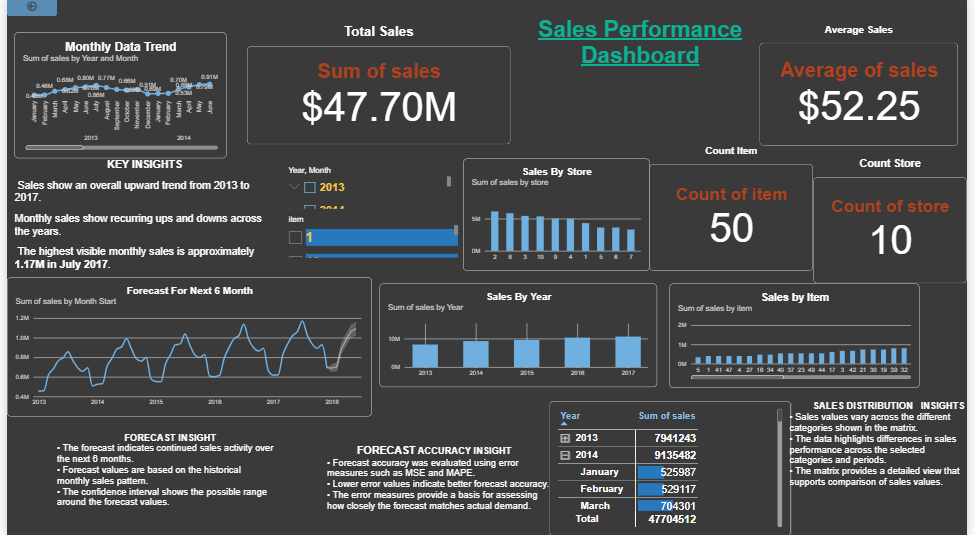

# Sales Forecasting & Performance Analytics

**Excel | Power BI | Forecasting**

## Project Overview

This project analyzes historical sales data to identify sales trends, monthly patterns, and performance variations. Forecasting methods were evaluated using Excel, and an interactive Power BI dashboard was developed to support short-term sales planning.

## Objective

Analyze historical sales data, evaluate forecasting methods, and develop a 6-month sales forecast to support data-driven planning decisions.

## Dataset

* **Records:** 913,000
* **Stores:** 10
* **Items:** 50
* **Period:** 2013–2017
* **Variables:** Date, Store, Item, Sales

## Tools & Methods

### Microsoft Excel

* Data cleaning and validation
* Pivot Table analysis
* Trend and seasonal analysis
* Moving Average
* Weighted Moving Average
* Exponential Smoothing
* MAPE and MSE evaluation

### Microsoft Power BI

* KPI analysis
* Sales trend visualization
* Store and item analysis
* Interactive dashboard
* 6-month sales forecast
* Confidence interval

## Key Findings

* Sales show an overall upward trend from 2013 to 2017.
* Monthly sales show recurring variations across the years.
* The highest monthly sales were approximately **1.17M in July 2017**.
* Sales performance varies across stores and items.
* The 6-month forecast provides an estimate of future sales based on historical monthly sales patterns.

## Power BI Dashboard

## Forecast

The Power BI dashboard includes a **6-month sales forecast with a confidence interval**, providing an estimate of future sales based on historical monthly sales patterns.

## Business Recommendations

### 1. Inventory Planning

Use forecasted demand to support short-term inventory and replenishment planning.

### 2. Resource Planning

Prepare operational resources based on periods of expected higher demand.

### 3. Demand Monitoring

Regularly compare actual sales with forecast values and update forecasts when new data becomes available.

### 4. Seasonal Planning

Consider recurring monthly sales patterns when making purchasing and resource-planning decisions.

## Final Outcome

An interactive **Power BI Sales Performance Dashboard** was developed to monitor historical sales performance and visualize the **6-month sales forecast with a confidence interval**.
